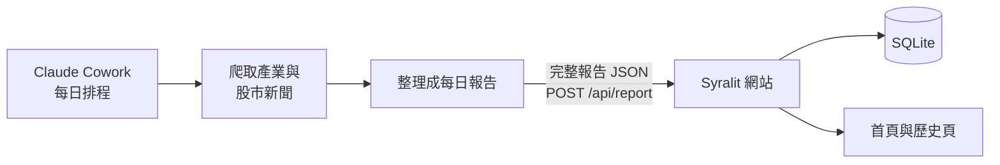

# Briefast

每日產業與股市新聞報告網站。Claude Cowork 在開盤前蒐集公開新聞、判讀個股多空並推送完整 JSON；Syralit 網站以固定的規線報紙版面顯示最新報告與歷史報告。

## 運作方式



- **前台**：`/` 顯示最新報告，`/history/` 每頁列出 10 份歷史報告並可檢視指定日期。
- **後台**：`/admin/` 以管理員密碼保護，可建立、完整檢視與撤銷 API key，並查看所有成功與拒絕紀錄。
- **接收 API**：`POST /api/report` 每次查驗 Bearer key，驗證整份 JSON 後以日期為鍵原子 upsert。
- **持久層**：SQLite `data/briefast.db`，啟動時自動套用 migration，啟用 WAL 與 5 秒 busy timeout。
- **即時更新**：成功 ingest 後透過 `sy.Shared` 讓已連線頁面 rerun。

網站不使用 Artifact Canvas 或 Artifact DSL。版面與紅漲綠跌語意由程式固定，agent 不能改變 UI 結構。

## 報告 JSON

```json
{
  "date": "2026-08-07",
  "headline": "美股收紅開盤氣氛偏多，看漲：台積電、緯創",
  "overview_md": "盤前總覽 markdown",
  "watch_md": "- 今日觀察 markdown 條列",
  "calls": {
    "short_bull": [{"symbol": "2330", "name": "台積電", "reason": "一句理由"}],
    "short_bear": [],
    "long_bull": [],
    "long_bear": []
  },
  "industries": [{"name": "半導體", "summary_md": "- 該產業要聞"}],
  "stock_news": [
    {
      "symbol": "2330",
      "name": "台積電",
      "call": "short_bull",
      "summary_md": "摘要段落，可含列點",
      "sources": [{"title": "新聞標題", "url": "https://example.com/news"}]
    }
  ],
  "generated_at": "2026-08-07T07:50:00+08:00"
}
```

`stock_news[].call` 只接受 `short_bull`、`short_bear`、`long_bull`、`long_bear`、`none`。日期必須是有效的 `YYYY-MM-DD`；`headline`、`overview_md`、`watch_md` 不得為空；每個 source 必須有 URL；四個 calls 清單中的每個 symbol 必須在 `stock_news` 有對應條目。`none` 代表有重大新聞但方向不明，不得放進 calls 清單，前台也不顯示多空標籤。

呼叫範例：

```bash
curl --fail-with-body \
  -H "Authorization: Bearer ${BRIEFAST_API_KEY}" \
  -H "Content-Type: application/json" \
  --data-binary @report.json \
  "${BRIEFAST_URL%/}/api/report"
```

成功回 `200 {"ok":true,"date":"2026-08-07"}`。Schema 錯誤回 400 與完整 `errors` 陣列，無效或已撤銷 key 回 401；兩種拒絕都會寫入 `update_log`，不會寫入報告。

## 本機開發

需求：Go 1.25.11 以上。

```bash
cp .env.example .env
# 編輯 .env，填入 BRIEFAST_ADMIN_PASSWORD
set -a; source .env; set +a
go test ./...
go run .
```

`syralit.toml` 已在版控中，clone 後不需要複製或修改。Go 程式不會自己解析 `.env`，所以本機啟動前要先如上把它載入環境；也可以直接在指令前帶環境變數：

```bash
BRIEFAST_ADMIN_PASSWORD='replace-me' go run .
```

預設網址是 <http://localhost:8600/>，資料庫是 `data/briefast.db`。

管理員密碼未設定時，公開頁與 API 仍可服務，但後台會拒絕登入並顯示設定錯誤。API key 依產品需求明文存於 SQLite，請限制 `data/` 或 Docker volume 的存取權限。

## Docker Compose 部署

```bash
cp .env.example .env
# 編輯 .env，填入 BRIEFAST_ADMIN_PASSWORD
docker compose up -d --build
```

Compose 會自動讀取本目錄的 `.env`，不需要額外參數。`syralit.toml` 已包進映像，不必掛載；`.env` 控制的是管理員密碼、對外埠與資料庫落地位置（`BRIEFAST_DATA`，預設為 named volume）。也可以直接注入環境變數：

```bash
BRIEFAST_ADMIN_PASSWORD='replace-me' BRIEFAST_PORT=8600 docker compose up -d --build
```

`BRIEFAST_PORT` 是主機對外 port，容器內固定使用 8600。資料目錄預設掛 `briefast-data` named volume；在 `.env` 把 `BRIEFAST_DATA` 設成主機路徑即改為 bind mount。主機目錄不需要事先建立或調整權限——容器啟動時會自行建立並把擁有者設為應用使用者，再降權執行，應用程序本身不以 root 執行。無論哪種，重建或重啟容器都不會刪除 reports、API keys 或 update log。網域與 HTTPS 應由外部反向代理處理。

## 每日流程 skill

`skills/daily-brief/SKILL.md` 定義完整四步驟與錯誤處理。agent 從**執行工作區根目錄**的 `.env` 讀取設定，範本見 `skills/daily-brief/.env.example`：

```
BRIEFAST_URL=https://briefast.example.com
BRIEFAST_API_KEY=brf_...
```

`.env` 不存在或任一鍵缺少時，skill 會在蒐集前停止。非 200 回應會帶回 response body；5xx 只重試一次，400 則依 `errors` 修正 payload，無法修正時原文回報。

## License

[GPL-3.0](LICENSE) © 2026 HazelnutParadise
