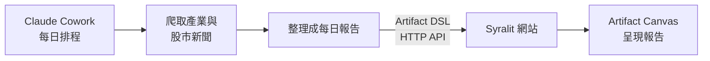

# Briefast

每日產業與股市新聞報告網站。新聞由 AI agent（Claude Cowork）每天抓取並整理成報告，透過 Syralit 的 Artifact API 更新到網站畫布上；打開網頁就能看到當天的產業動態與股市重點。

## 運作方式

- **網站**：以 [Syralit](https://github.com/HazelnutParadise/syralit)（Go 的互動式資料應用框架）打造，內嵌 Artifact Canvas，只接受帶驗證的 agent 更新。
- **每日流程**：repo 內附給 Cowork 執行的流程 skills，定義每天「爬新聞 → 整理 → 產生 Artifact DSL → 更新網站」的步驟。
- **部署**：Docker Compose。

## 專案狀態

初始化中，網站程式與每日流程 skills 尚未建立。目前 repo 內容：

| 路徑 | 說明 |
|---|---|
| `.claude/skills/`、`.agents/skills/` | Syralit 開發與 Artifact DSL 兩個 skills，自 [HazelnutParadise/syralit](https://github.com/HazelnutParadise/syralit) 安裝，由 `skills-lock.json` 追蹤 |

## License

[GPL-3.0](LICENSE) © 2026 HazelnutParadise
